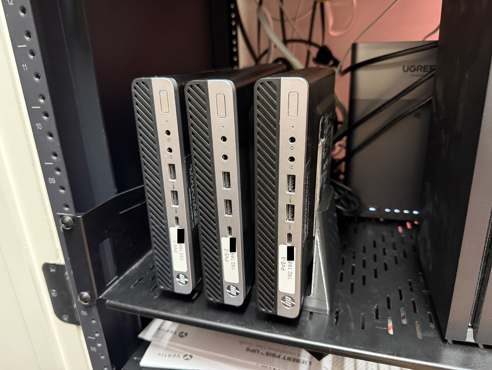
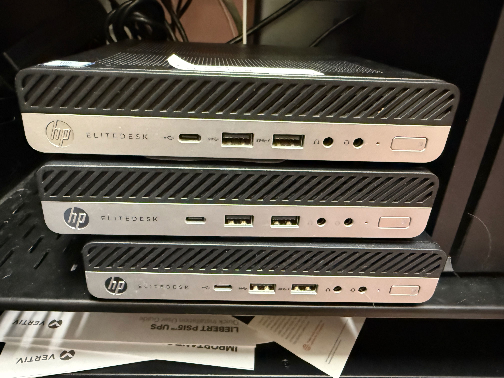
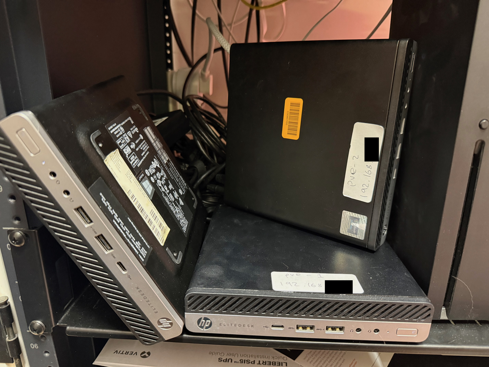
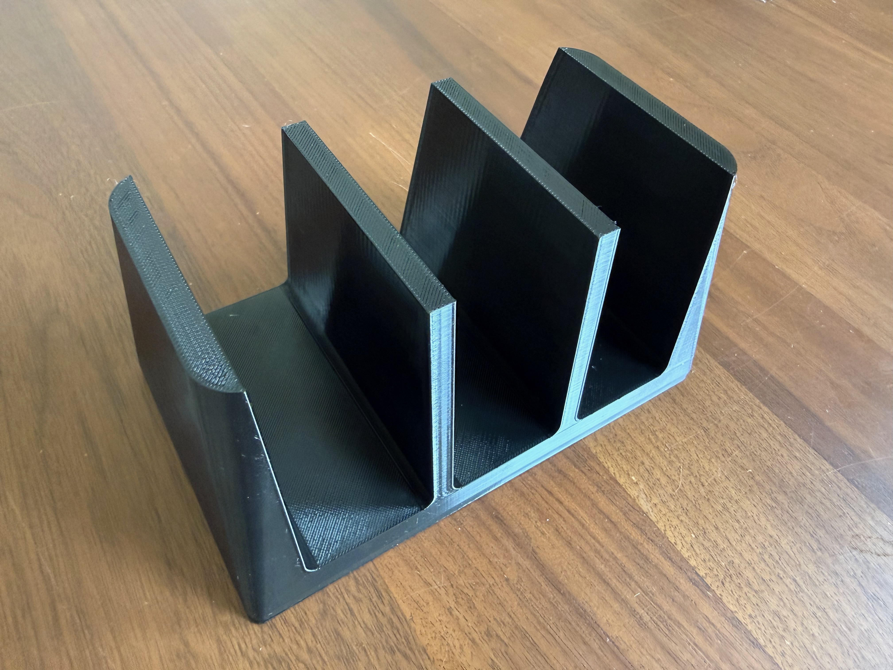
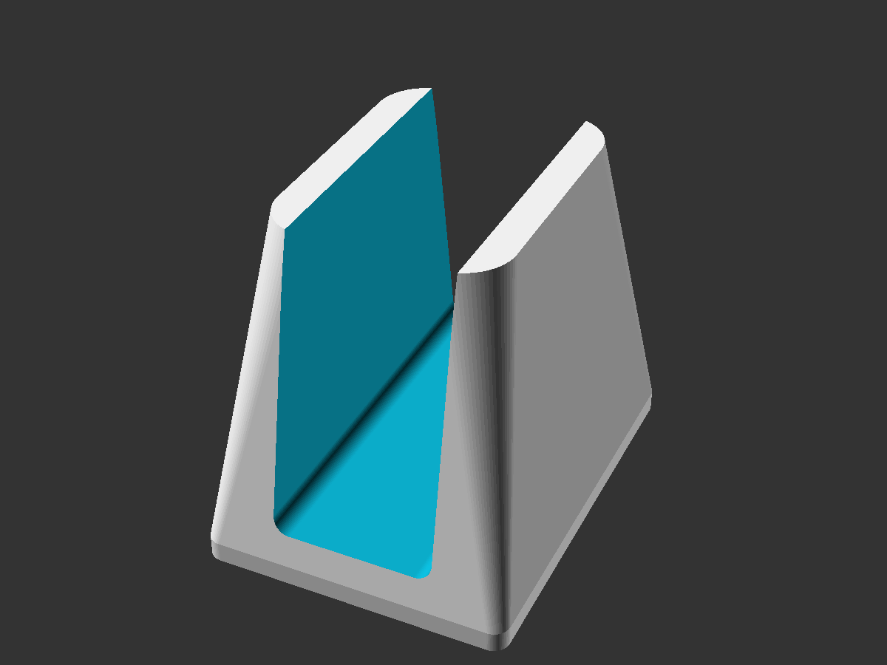
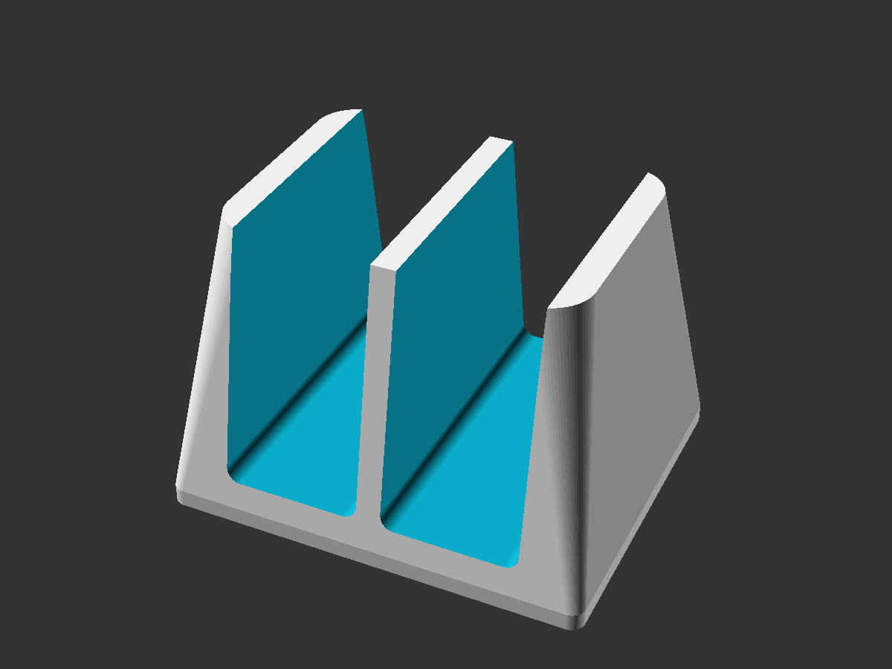
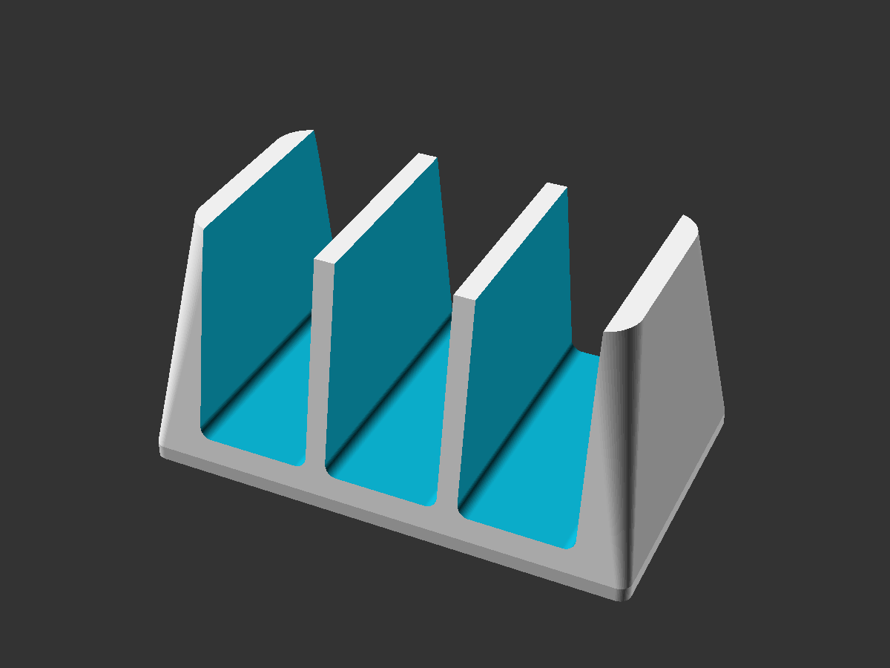
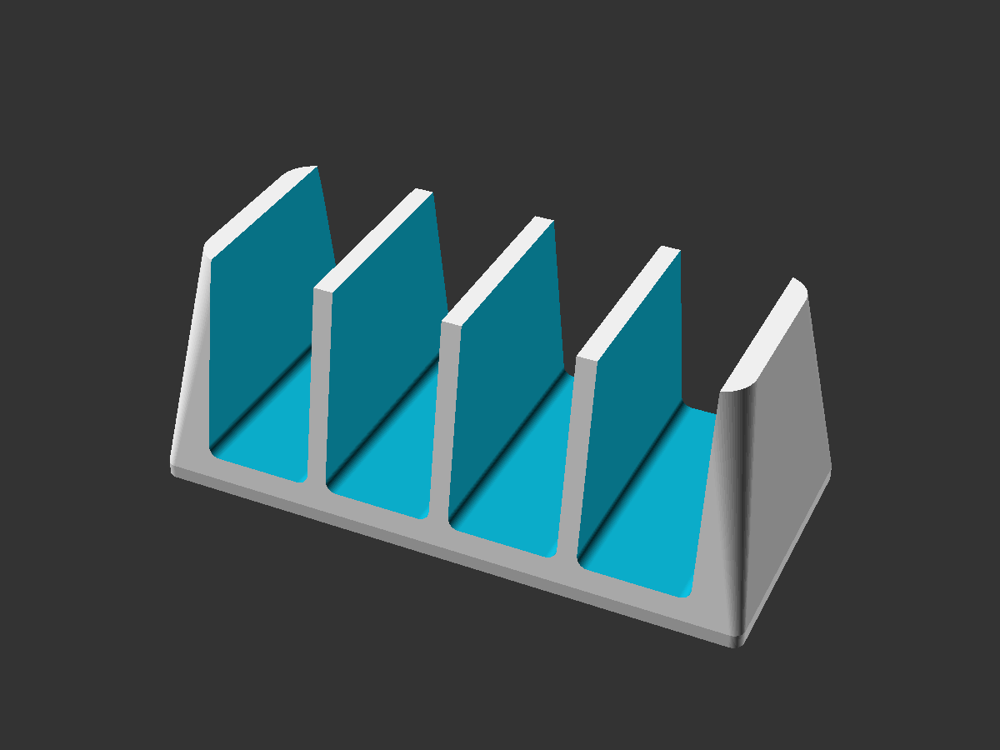

# HP EliteDesk Mini Vertical Stand

A 3D-printable vertical stand for HP EliteDesk Mini PCs, designed entirely through conversation with [Claude Code](https://claude.ai/claude-code) (Anthropic's AI coding assistant). One parametric [OpenSCAD](https://openscad.org/) file generates 1, 2, 3, or 4-slot variants.



## The Problem

I run a three-node [Proxmox](https://www.proxmox.com/) cluster on HP EliteDesk 800 Mini PCs. These tiny machines are great for homelabs -- quiet, low power, and surprisingly capable. But I had them stacked directly on top of each other in a server rack, and the heat from the bottom machine was cooking the one above it, and so on up the stack. The fans were spinning up constantly, and it wasn't sustainable.



As a short-term hack I arranged the machines in this fashion to improve airflow and aesthetics:



To make it not terrible though, I wanted a stand that would hold all three machines vertically, side by side, with air gaps between them. Something like those [BookArc-style laptop stands](https://www.twelvesouth.com/products/bookarc-for-macbook) -- an elegant arch shape with slots for each machine. I ended up with this, which is not what I originally described but is in fact a better solution:



## How It Was Made: AI-Designed, Start to Finish

This entire project -- from concept to printable STL files -- was done through a conversation with Claude Code. Here's how it went.

By the way, this README was writted by Claude as part of what I prompted it to do, but I did actually read it and although it doesn't write like me, it's actually done a pretty good job here. I added a few sentences of my own here and there.

### Choosing the Right Tool

My first instinct was [Blender](https://www.blender.org/). I have some experience with it, and I figured I'd need Claude to guide me through the modeling process. But when I asked Claude Code to research the options, it came back with a better suggestion: [OpenSCAD](https://openscad.org/).

OpenSCAD is a code-based CAD tool -- you describe geometry with a simple scripting language rather than manipulating meshes by hand. Claude pointed out that this was a much better fit for AI-assisted design for a few reasons:

- **Claude can write the file directly.** OpenSCAD files are just text -- no GUI interaction needed. Claude wrote the `.scad` file in one shot.
- **The shape is geometric, not organic.** A stand with slots, walls, and an arch profile is exactly what parametric CAD is good at.
- **It's trivially parametric.** Want 4 slots instead of 3? Change one number. All dimensions are derived from variables at the top of the file.
- **There's a CLI.** OpenSCAD can render and export from the command line, so Claude could generate STL files and preview images without a GUI.

There's also [BlenderMCP](https://github.com/ahujasid/blender-mcp), a project that lets Claude control Blender directly through natural language via an MCP server. It's impressive (16k+ GitHub stars), but for a geometric part like this, OpenSCAD was the right call.

### Describing What I Wanted

I showed Claude two reference photos of BookArc-style laptop stands -- the kind with a smooth arch and a central slot for a laptop in clamshell mode. I described what I wanted in pretty vague terms:

> "I want the same kind of arch design that can hold three of these things side by side, all vertically pointing upwards. When the thing is finished, the overall shape is like an arch that has been extruded. It will have three slots in it, and when those machines are inserted, the power buttons are going to be pointing towards the front and the ports towards the back."

That was about it. Claude already knew the dimensions of the HP EliteDesk Mini (approximately 177 x 175 x 34mm -- consistent across G3 through G6 generations), so it could calculate slot widths, wall thicknesses, and overall dimensions without me needing to measure anything.

### The Design Process

Claude produced a working OpenSCAD file on the first attempt. The design is a tapered arch shape -- wider at the base for stability, narrowing toward the top with rounded edges. Three slots are cut from the top, each sized for an EliteDesk with 5mm of clearance.

We iterated on a few things through conversation:

- **Reduced the base height.** The original had about 25mm of solid material below the slots. I asked to halve it, and we settled on a version with ~13mm -- enough material for structural integrity while using less filament.
- **Tried to add slot numbers.** Claude attempted to engrave "1", "2", "3" on the front face below each slot (matching my pve-1, pve-2, pve-3 node names). This didn't work well -- the numbers were getting clipped at the transition between the flat base and the angled body, and we had issues with text mirroring in OpenSCAD's 3D coordinate system. After a few attempts, we dropped them entirely. This was one area where the AI struggled.
- **Adjusted positioning.** Several rounds of "move this up 4mm," "actually down 2mm" type adjustments, which Claude handled instantly.

### What the AI Got Right (and Wrong)

**What worked well:**
- Translating a vague English description into a functional parametric design
- Knowing the PC dimensions without me having to measure anything
- Making the design fully parametric (one variable controls the number of slots)
- Generating STL files and preview images from the command line
- Iterating on dimensions through conversation

**What didn't work:**
- Embossed text on an angled surface was a struggle. OpenSCAD text in 3D requires getting rotations, extrusion depths, and coordinate transforms exactly right. After several attempts with mirrored, clipped, or invisible text, we removed it. This is a genuinely hard problem in programmatic CAD.

**What surprised me:**
The final shape isn't the rainbow arch I originally described -- it's more of a tapered wedge. But after printing it, I realized this was actually a *better* design than what I asked for. A true arch with overhangs would have been difficult to 3D print without supports. The tapered shape Claude produced prints flat-base-down with zero supports, is structurally solid, and holds the machines securely. Sometimes the AI's practical constraints produce a better result than your original vision.

## The Result


The stand printed in about 8 hours in black PETG on an AnkerMake M5. It works exactly as intended -- three machines standing vertically with good air gaps between them, power buttons accessible at the front, ports at the back. The fans are noticeably quieter now.

## The Fully Automatable Pipeline

One interesting aspect of this project: almost the entire pipeline from idea to physical object is automatable with AI.

| Step | Automatable? | How |
|------|-------------|-----|
| Describe what you want | Human | Natural language conversation |
| Generate the CAD file | Yes | Claude writes OpenSCAD code |
| Preview the design | Yes | `openscad -o preview.png --viewall --autocenter file.scad` |
| Export to STL | Yes | `openscad -o file.stl file.scad` |
| Slice for printing | Depends | Some slicers have CLIs (PrusaSlicer, Cura) |
| Send to printer | Depends | OctoPrint, Klipper, etc. have APIs |

My AnkerMake M5 doesn't have a public API, so slicing and sending the print job was manual. But if you have a printer behind [OctoPrint](https://octoprint.org/) or [Klipper](https://www.klipper3d.org/) with [Moonraker](https://moonraker.readthedocs.io/), the entire chain from "I want a thing" to "the printer is printing it" could be done by an AI agent running autonomously.

With something like [herdctl](https://github.com/edspencer/herdctl) (an agent orchestrator for Claude Code), you could set up a scheduled agent that takes design requests from a chat message, generates the OpenSCAD file, renders a preview, exports the STL, slices it, and sends it to the printer. The human's only job would be to describe what they want and load the filament.

## Downloads

Pre-built STL files are ready to slice and print:

| Variant | STL | Preview |
|---------|-----|---------|
| 1 slot (single PC) | [elitedesk-stand-1slot.stl](stl/elitedesk-stand-1slot.stl) |  |
| 2 slots | [elitedesk-stand-2slot.stl](stl/elitedesk-stand-2slot.stl) |  |
| 3 slots | [elitedesk-stand-3slot.stl](stl/elitedesk-stand-3slot.stl) |  |
| 4 slots | [elitedesk-stand-4slot.stl](stl/elitedesk-stand-4slot.stl) |  |

## Customizing

The design is a single parametric [OpenSCAD](https://openscad.org/) file. All dimensions are controlled by variables at the top of `elitedesk-stand.scad`:

```scad
pc_thickness = 34;       // mm - case thickness
clearance    = 2.5;      // mm per side (5mm total play)
slot_depth   = 72;       // mm - how deep from top of stand
num_slots    = 3;         // number of PC slots
inner_wall   = 7;        // mm - wall between adjacent slots
outer_wall   = 8;        // mm - outer wall on each side
stand_d      = 100;      // mm - front-to-back depth
stand_h      = 85;       // mm - total height
```

To generate STL files from the command line without opening the GUI:

```bash
# Install OpenSCAD
brew install --cask openscad    # macOS
# apt install openscad          # Debian/Ubuntu

# Generate a 3-slot STL
openscad -o elitedesk-stand-3slot.stl elitedesk-stand.scad

# Generate a 4-slot variant (override num_slots)
openscad -D "num_slots=4" -o elitedesk-stand-4slot.stl elitedesk-stand.scad

# Render a preview image
openscad -o preview.png --imgsize=1200,900 --viewall --autocenter elitedesk-stand.scad
```

### Adapting for Other Mini PCs

The stand should work for any mini PC with similar dimensions. To adapt it:

1. Measure your PC's thickness (the dimension that becomes the slot width)
2. Update `pc_thickness` in the SCAD file
3. Adjust `clearance` if needed (2.5mm per side works well for a snug-but-not-tight fit)
4. Re-export the STL

Compatible as-is with:
- HP EliteDesk 800 G3/G4/G5/G6 Mini
- HP ProDesk 600 G3/G4/G5/G6 Mini
- HP ProDesk 400 G3/G4/G5/G6 Mini
- Lenovo ThinkCentre M series Tiny (similar dimensions, may need slight adjustment)

## Print Settings

| Setting | Recommendation |
|---------|---------------|
| Material | **PETG** (recommended -- better heat resistance near warm PCs) or PLA |
| Layer height | 0.2mm |
| Infill | 20-30% |
| Walls/perimeters | 3-4 |
| Supports | None needed |
| Orientation | Flat base down |
| Print time | ~8 hours (3-slot, varies by printer) |
| Filament | ~200g (3-slot) |

## Dimensions

### 3-Slot (Default)

| Dimension | mm | inches |
|-----------|----|--------|
| Width (body) | 147 | 5.8 |
| Width (at flared base) | 167 | 6.6 |
| Depth (front to back) | 100 | 3.9 |
| Height | 85 | 3.3 |
| Slot width | 39 | 1.5 |

The PCs extend about 103mm above the stand and overhang ~38mm on front and back. This is intentional -- it allows airflow around the cases and easy access to ports and power buttons.

## License

This project is released under the [MIT License](LICENSE). Use it, modify it, print it, share it.

## Acknowledgments

Designed with [Claude Code](https://claude.ai/claude-code) by Anthropic. The entire design, from concept through parametric OpenSCAD code to exported STL files and preview renders, was produced through natural language conversation with an AI assistant.
